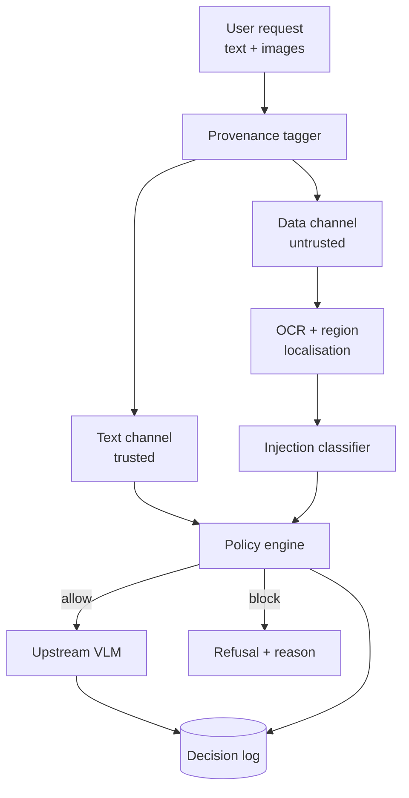

# System Architecture — Hearsay

## Overview

A transparent proxy in front of any vision-language model. The agent talks to the
proxy; the proxy talks to the model. Nothing inside the model changes, so the
defence transfers across model versions.

## Components

**Provenance tagger.** Assigns every input a channel label at ingestion. The
user's typed prompt is the only instruction-bearing source by default. Everything
else — uploaded images, fetched pages, tool outputs — is data. This label travels
with the content and cannot be changed by content.

**OCR and region localisation.** Extracts text from image inputs with bounding
boxes, so a flagged region can be shown to the user rather than blocking the whole
request. Engine choice is an ablation variable, not a fixed decision.

**Injection classifier.** A fine-tuned encoder (DeBERTa-v3 class) scoring extracted
text for imperative intent directed at the model rather than at the reader. Trained
on the project's own corpus plus public text-injection sets.

**Policy engine.** Combines channel label and classifier score into a decision.
Deterministic and auditable — no model call. This is deliberately simple so the
decision can be explained in a demo.

**Decision log.** Append-only, keyed by input hash. Enables replay of any decision
and supports the audit section of the report.

## Data flow

1. Request arrives; tagger labels each part.
2. Image parts go through OCR; text regions inherit the data label.
3. Classifier scores each data-channel text region.
4. Policy engine decides; blocked regions are redacted rather than the request
   being dropped, where possible.
5. Sanitised request goes upstream; response and decision are logged.

## Technology choices

The serving path is Rust; model training stays in Python and hands over a
frozen ONNX artefact. See `design.md` §1 for the reasoning and the honest cost.

| Layer | Choice | Why |
| --- | --- | --- |
| Proxy | axum + tokio | Predictable tail latency against the 400 ms p95 budget; one static binary |
| OCR | Tesseract (`leptess`) or PP-OCRv4 (ONNX) | Compare both; report the difference |
| Classifier | DeBERTa-v3-base, fine-tuned, served via ONNX Runtime (`ort`) | Fast enough for the latency budget |
| Cache | Redis | Deduplicate repeated images |
| Upstream | Any OpenAI-compatible VLM endpoint | Keeps the defence model-agnostic |
| Training | Python / PyTorch, exported to ONNX | Offline; no reason to fight the ecosystem |

## Deployment

Single container, GPU optional (CPU inference is within budget for the classifier).
Health endpoint, metrics endpoint, and a small React dashboard showing live
decisions for the demo.

## Interfaces

- `POST /v1/chat/completions` — OpenAI-compatible, so existing clients work unchanged.
- `GET /decisions/{id}` — retrieve a logged decision with the flagged regions.
- `GET /metrics` — Prometheus format.
